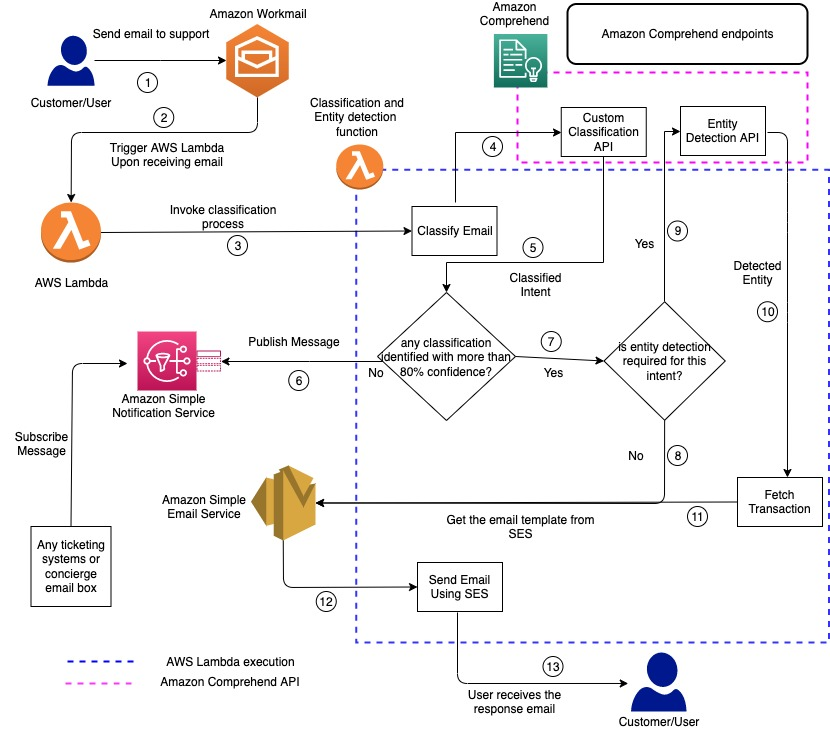

# Email Response Automation with Amazon Comprehend

This project is developed to showcase how Amazon comprehend can be used to classify the incoming email and respond back to the customer automatically. 

Supporting customer via email channel is one of the big task for every organization sinch it involves human resources, space, devices,and other technologies. Also, this is very expensive process and not addressing customer queries leads to huge customer churnout and impacting the revenue and reputation of the organization. 

Many of a times, customer asks the basic questions and it is unnecessary that customer care rep to respond to all the emails unless the request is critical or sensitive. Amazon Comprehend is managed AI service which helps to extract insights from the content of documents. In this project, we used Amazon Workmail to receive the customer email and that triggers the lambda function to pass the content to Amazon Comprehend to classify content and respond back to the customer via email with pre-defined answer for the known requests.

## Process Flow / Architecture Diagram



## CDK project structure :
The soultion comprised of two cdk stacks.

`comprehend-custom-classifier-dev-notebook-stack` : Creates the Amazon sagemaker jupyter notbook instance pre-loaded with .ipynb notbook and creates IAM role required for executing comprehend custom classification training, deployment, and S3 data access.
`workmail-organization-domain-user-dev-stack` : Creates the Amazon workmail with domain, user, inbox access.

## Pre-requisites
* AWS CLI >= 2.2.25 (Please follow [this](https://docs.aws.amazon.com/cli/latest/userguide/install-cliv2-linux.html#cliv2-linux-upgrade) guide to install/upgrade AWS cli)
* AWS CDK command line utility (1.120.0) (Please follow [this](https://docs.aws.amazon.com/cdk/latest/guide/getting_started.html) guide to install/upgrade cdk.)
* Python>=3.7

### Note: You can deploy these stacks in us-east-1(N.Virginia) or us-west-2(Oregon) or eu-west-1(Ireland) (Amazon workmail available only in these 3 regions)

## Steps to deploy the project
1. Clone the repository.

```
git clone git@github.com:aws-samples/email-response-automation-comprehend.git
```

2. This project is set up like a standard Python project. To create the virtualenv it assumes that there is a python3 (or python for Windows) executable in your path with access to the venv package. create the virtualenv using following command.
```
$ python3 -m venv .venv 
```

3. Use the following step to activate your virtualenv.
```
$ source .venv/bin/activate
```
If you are a Windows platform, you would activate the virtualenv like this:
```
% .venv\Scripts\activate.bat
```
Once the virtualenv is activated, you can install the required dependencies.
```
$ pip install -r requirements.txt
```
4. Deploying the solution :

Deploying new Sagemaker Notebook Instance with IAM Roles and pre-loaded .ipynb notebook : Execute following command by passing optional paramaters
```
cdk deploy comprehend-custom-classifier-dev-notebook-stack  --parameters NotebookName=<Notebook Name> --parameters NotebookConfigName=<Notebook Config Name> --parameters RoleName=<SageMaker execution role name>
```

Arguments to the stack creation :
* NotbookName :(optional) Name of the notbook instance. If not entered, default name 'notebook-instance-comprehend-training' will be used.
* NotebookConfigName :(optional) Name of the  Notebook config. If not entered, default config name 'notbook-lifecycle-load-notebook' will be used.
* RoleName : (Optional) Name of the Amazon Sagmaker Execution role name. If not entered, default role name 'sagemaker-notebook-execution-role' will be used.

Deploying new Workmail domain, user, user registration and inbox: Execute following command by passing optional paramaters
```
cdk deploy workmail-organization-domain-user-dev-stack --parameters OrganizationName=<Organization Name> --parameters UserName=<Support Username> --parameters PassWord=<Password>
```
Arguments to the stack creation :
* OrganizationName :(Required) Name of the workmail organization. If not entered, default name 'my-sample-workmail-org' will be used. Domain also will be created using this organization alias name. So make sure to use unique alias to avoid errors due to duplicate domain names.
* UserName :(optional) Name of the your organization support user alias. If not entered, default user name 'support' will be used.
* PassWord : (Optional) Password for the UserName. If not entered, default password 'Welcome@123' will be used.

Note : Please note that these both deployments approximately 20 to 25 minutes

After the stacks are succefully deployed (You can see if there is an error as the cdk output otherwise it says stacks creation succeful.), please open the .ipynb notebook from Sagemaker notebook instance and execute all the scripts in the notebook in sequence. 
### Steps to open the .ipynb file from the notbook instance
1. Go to AWS console and select the service 'Amazon Sagemaker'. Maker sure you are in us-east-1 region
2. Select the Notebook menu and choose Notbook Instances

3. Click 'Open Jupyter' from the Action menu

4. You can see the notebook 'notebook-instance-comprehend-training' and click to open the notbook
5. Run the script as per the instruction given in the notebook. Classification endpoint and Entity Detection endpoint will be created.  Please use these ARNs as the context variables for the next stack deployment.

Below CDK Deployment will create AWS Lammbda fucntions, Amazon SES and SNS notifications: Execute the following command by passing the context variables
```
cdk deploy email-class-workflow-stack -c email_classification_endpoint_arn= <email classification endpoint ARN from sagemaker notebook>  -c human_workflow_email=<Workflow Email> -c support_email=<support email id created part of the workmail-organization-domain-user-dev-stack> -c email_entity_recognition_endpoint_arn=<Enitity Detection endpoint ARN from sagemaker notbook>
```
Arguments to the stack creation :

* email_classification_endpoint_arn (required) : email classification endpoint ARN from sagemaker notebook
* human_workflow_email (required) : email id to receive the SNS notification if customer email content does not match with any classifcation. The email id will subscribe from SNS topic and SNS will publish unclassified email to the topic. 
* Support Email (required) : Email id created part of the workmail org and user creation. This email id will receive email from the customer and invoke the lambda function
* email_entity_recognition_endpoint_arn (required) : email entity recognition endpoint ARN from sagemaker notebook

Setting up the Inbound rules in Amazon Workmail using the lambda function generated in previous stack. Please use the  'Amazon Workmail Inbound Rule Setup with Lambda.docx' file to complete this setup


## Testing the solution by sending an email to support email. You will either get automatic reply with predefined reply content depends on the classification from the comprehend custom classifcation model.
Currently 3 type email classification will be used for automatic response back to customer.
1. MONEYTRANSFER  - Customer email contains query about the money transfer 
2. PASSRESET - Customer email contains query related to login, account locked or password request
3. PROMOCODE - Customer email contains query related to discount or promo available for the money transfer
If the customer email does not belong to any of the above classifcation, customer email will be moved to SNS topic and whoever subscribe the topic will receive the message. In our testing we subscribe with human workflow email (ex: your presonal email) to verify the mail has been moved to SNS topic.
